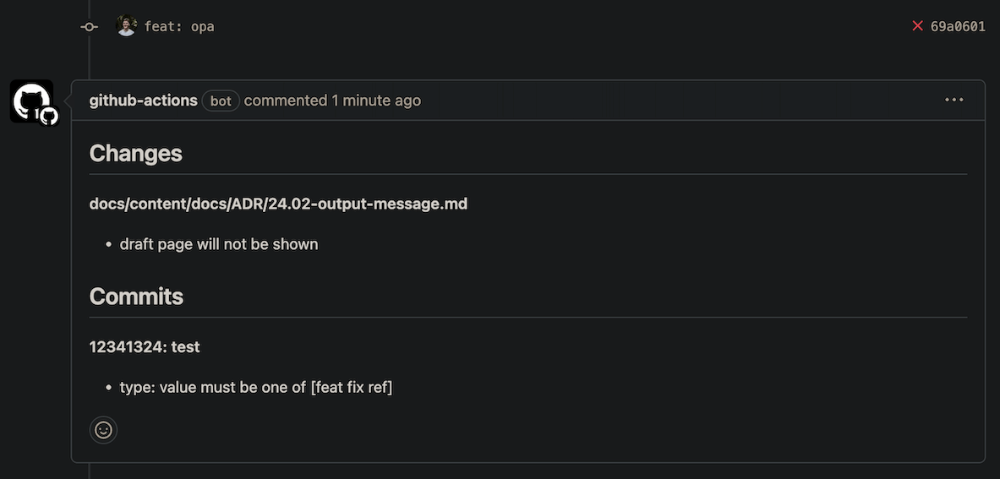

`Changes` helps automate code review and enforce team agreements.

It validates git diff with simple configuration and [the CEL scripting language](https://github.com/google/cel-spec).

[Visit project GH pages site for detail documentation.](https://rusinikita.github.io/changes/)

```yaml
commit:
  # Commit message format validation. Example - `TEAM-123: fix something`
  subject: '(issue): (type)? (title)'
  values:
    issue:
      regexp: TEAM-\d+
check-functions:
  - message: use separate PRs for fixes and features
    # Function checks parsed commit types
    func: 'commits.exists(c, c.type == "fix") && commits.exists(c, c.type == "feat")'
  - message: page contains draft flag and will not be shown
    # Function checks changed files and its content
    func: changes.filter(c,
      c.path.endsWith(".md") && c.chunks.exists(ch, ch.content.contains("draft:"))
      )
```

### Output

```shell
Changes
-------
docs/content/docs/ADR/24.02-output-message.md
- draft page will not be shown

Commits
-------
12341324: test
- type: value must be one of [fix ref feat]
```

### Autonomous

You can use it locally, as a CI step, and in combination with messages posting tools.



[See working GitHub actions configuration](https://rusinikita.github.io/changes/docs/mvp-usage/#github)

## Alternatives

[Danger](https://danger.systems/js) and [conventional-changelog](https://github.com/conventional-changelog) - both great
tools for JS and Ruby community.

`Changes` brings advantages for users of other languages:

1. yaml/toml configuration familiarity and simplicity
2. One tool to rule. Validation and changelog generation use the same message format
3. Well-designed configuration and scripting DSL
4. Go code maintainability and execution speed

## Project state

> [!NOTE]
> ##### Production ready
> Project has solid API and active maintenance.
> 
> Please provide your feedback and ideas in [discussions](https://github.com/rusinikita/changes/discussions).

> [!TIP]
> #### Support
> Use `!` in [issue title](https://github.com/rusinikita/changes/issues/new) to get help within 2 hours.

[Visit project GH pages site for detail documentation.](https://rusinikita.github.io/changes/)
