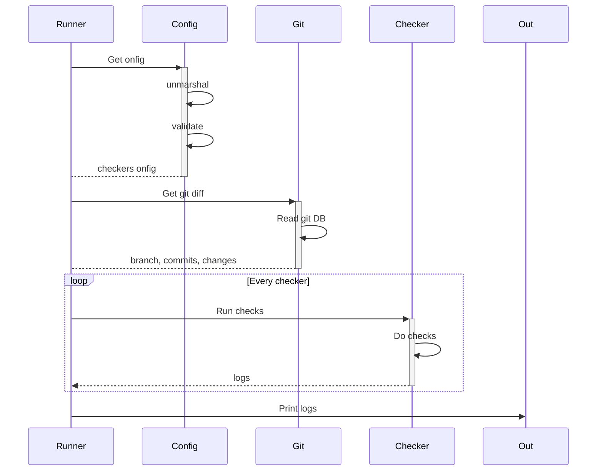



## Project goal

- Simple cli tool for PR validation automation
- Become simpler to integrate, well documented and faster alternative to Danger

## Context

#### Commit history

[Commit messages quality matters](https://cbea.ms/git-commit/)

Examples:
- Message format checks
- Issue actual status check
- Change log generation
- Author email domain
#### PR changes

Simple automation using changes info can encourage developers to spend little time now to save more time on code review and tech debt in future.

Examples:
- Config files editor whitelist
- Whitelist libraries
- Is docs edited with code

#### [Danger](https://danger.systems/js/)

[Danger](https://danger.systems/js/) is a great project for PR automation. But I think it's overcomplicated.

I can do alternative with:
- More friendly documentation site
- Yaml/Toml configuration with batteries included checks for easy start
    - Config UX is similar to linters and other tools
    - No Ruby/JS knowledge required
    - Validation and type-safety => config autoupdate
- Faster computation by Go multithreading and go-git
- Plain text output
    - Simpler
    - Can be used with other tools (post Slack or PR message)

#### [Conventional commits](https://www.conventionalcommits.org/en/v1.0.0/)

Is great way of declare changes. It goes with [commitlint](https://github.com/conventional-changelog/commitlint) and [changelog](https://github.com/conventional-changelog/conventional-changelog) tool. But i think It can be single tool with more customisation for easy integration.

I can do commit message format template that can be used for validation and generation at same time.

[Conventional-pr](https://github.com/Namchee/conventional-pr) [sv4git](https://github.com/bvieira/sv4git)

Same idea, simple yaml config. But lack of configuration options and no documentation.

## Design draft

#### Usage

Project has .changes.yml/toml config file.

Validation:
-  `changes lint -last 10` for last 10 commits
-  `changes lint pr` for PR new commits

Result:
```
INFO sdfdhfsald12 message bla bla bla
ERROR sdfdhfsald12 message bla bla bla
ERROR history message bla bla bla
```  

Where `sdfdhfsald12` is commit sha.

Change log generation:
- `changes log -last 10`
- `changes log -pr`
#### Config

MVP config - code

```go
r := runner.New()

r.AddChecker(checkers.TotalChange{
    MaxLines: 200,
})

r.AddChecker(checkers.ProtectedFiles{
    Paths: []string{".golangci-lint", "git-checks.go"},
})

result := r.Run()
// result.PrintJson()
result.Print()
```

Yaml

```yaml
version: "0.1"
local_run_last_commits: 10
output_format: "json"
checks:
    - name: "branch_name"
      format: "^\(fix|feature)\*"
    - name: "total_change"
      max-lines: 200
    - name: "protected_files"
      paths: [ ".golangci-lint", "git-checks.go" ]
```

#### Package design

[https://go.dev/doc/modules/layout](https://go.dev/doc/modules/layout)

- runner - linter pipeline interface and implementation
- config - different configuration sources
- git - git abstraction using go-git
- checker - interface, checks DTO
- rule - batteries included chesks
- cmd/main.go - cli cmd

Repository can be used as library.



#### Interfaces

Checker is an interface which implements different lint rules.

Program:

1. Collects a list of registered checks and their configuration
2. Validates the configuration of each check (Validate())
3. Gets the history from Git

For each commit, it runs CheckCommit checks and collects TotalChange.

```go
type Logger interface {
    Debug(message string)
    Info(message string)
    Warning(message string)
    Error(message string)
}
  
type Checker interface {
    Type() CheckerType
    Validate() error
    CheckCommit(ctx CommitCheckerContext)
    CheckHistory(ctx HistoryCheckerContext)
}
  
type HistoryCheckerContext interface {
    Logger
    Branch() Branch
    Total() TotalChange
}
  
type Branch struct {
    Name string
}
  
type CommitCheckerContext interface {
    Logger
    Commit
}
  
type TotalChange struct {
    Commits uint
    Changes []FileChange
}
  
type Commit interface {
    Message() CommitMessage
    Changes() []FileChange
}
  
type CommitMessage struct {
    Title, Body, Footer string
}
  
type FileChange struct {
    Path     string
    Add, Del int
}
  
type CheckerType struct {
    Name string
    // OnlyCI sets checker runnable only in CI environment
    // not runnable locally
    OnlyCI bool
}
```

#### First rules

1. PR changes max lines
2. Commit changes max lines
3. Commit format: max length and title regex
4. Footer regex or footer words
5. Conventional commits (check + changelog)
6. Emoji ban, symbol set whitelist
7. Rebase forcing
