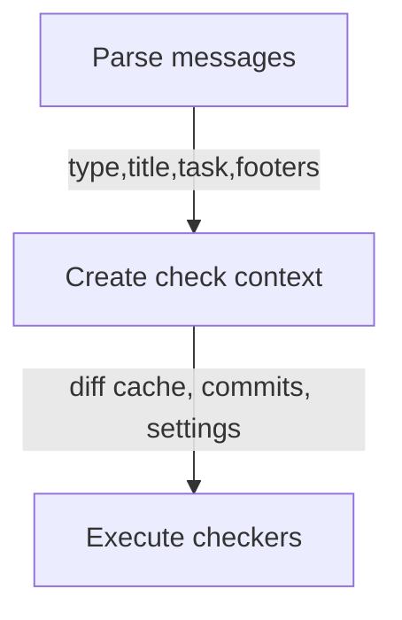




Based on [init draft]()




## Goal

Tool intended to be used for complex checking like:
- Feature commit must contain new ADR file
- PR must contain changelog file change
- Only 'docs' commits can contain doc folder changes
- Only 'bump' commits can change package.json
- Only Nikita can edit CI files 

## Commit message format is base

Commit type and other information is useful for checkers.
Because of that, commit messages should be parsed first.

