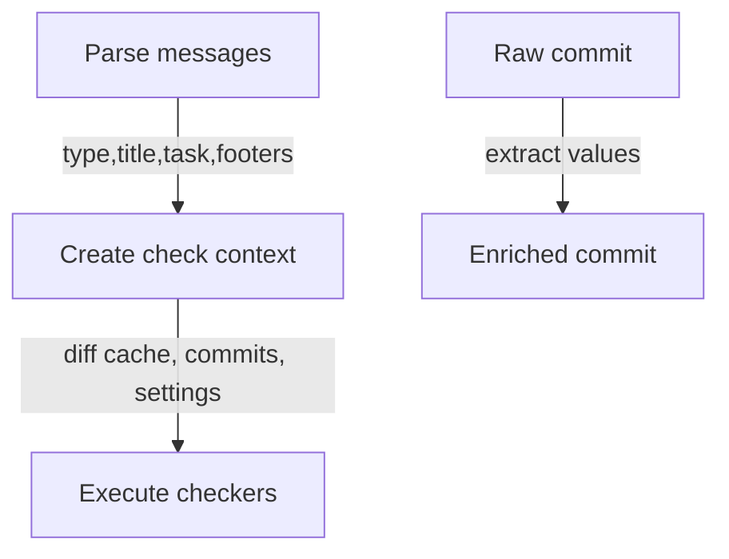
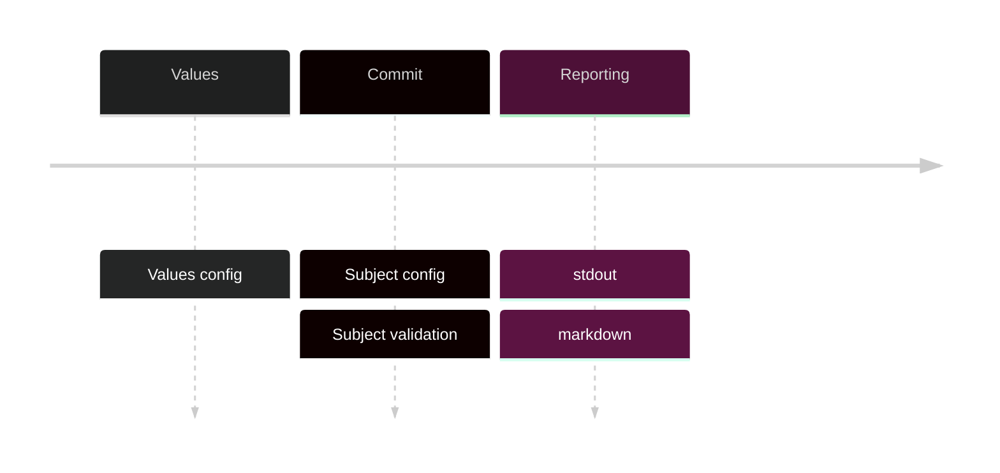
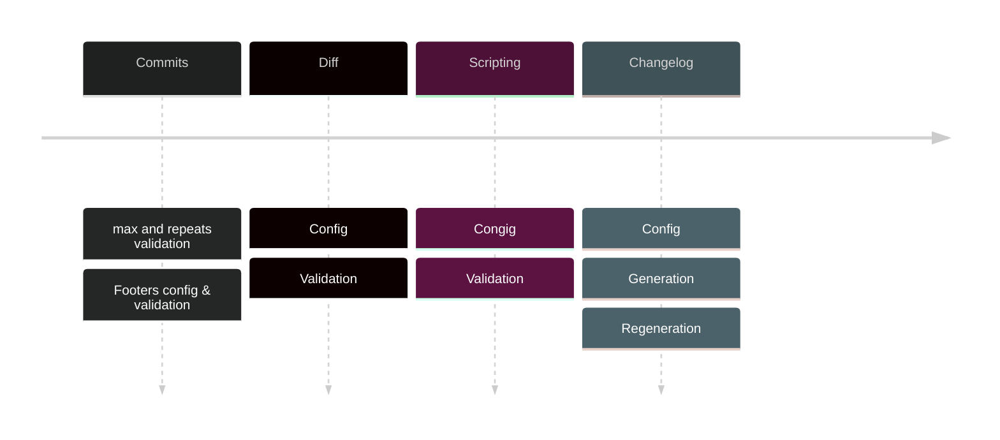




Based on [init draft]()




## Goal

Tool intended to be used for complex checking like:

- Feature commit must contain new ADR file
- PR must contain changelog file change
- Only 'docs' commits can contain doc folder changes
- Only 'bump' commits can change package.json
- Only Nikita can edit CI files

## Commit message format is base

Commit type and other information is useful for checkers.
Because of that, commit messages should be parsed first.



## Checker context values

There is no profit from overcomplicated solution such as handlers + context.

Solution - set of functions:

- Values validation settings parsing
- Text checking
- Subject parsing
- Footers parsing
- Body checking
- Commits list checking
- Diff checking

## Reporting

We need ability to provide additional error context and group output by this context.

```markdown
8213ff: some commit subject

- incorrect formatting
  8213ff: some other commit subject
- wrong task format
```


Errors itself can't answer "why there is no error".


I experimented with different types of logging + error interfaces.
And decided to keep things simple.

There will be errors package:

- Multiple errors collection
- Path adding and grouping

These two features allows to do any kind context error handling and reporting.

Additional logging:

- Main execution stages and steps
- Important variables

## Development plan




