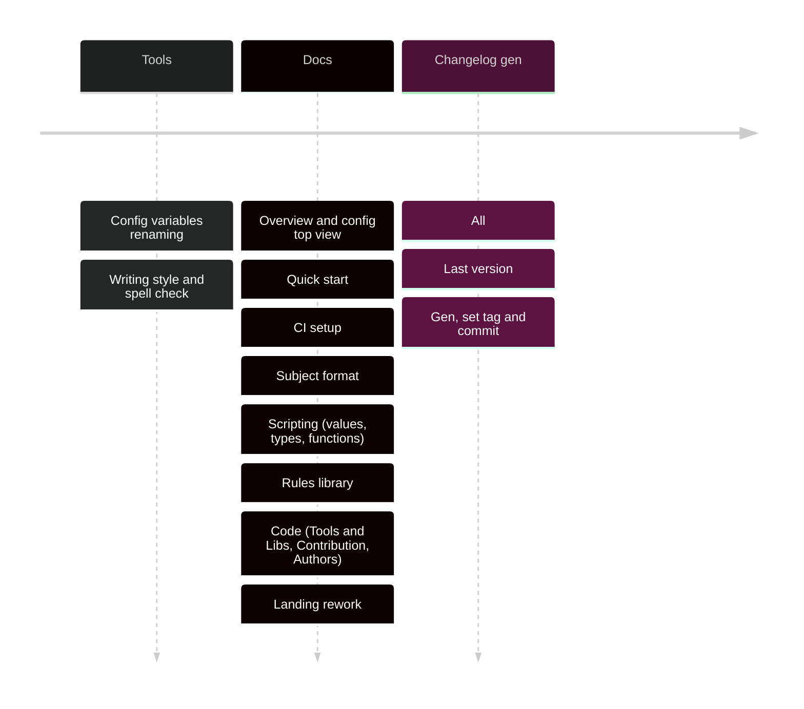

Prototype is finished. Next goal is good marketing message and starting documentation.

## Renaming

1. `commit.format` -> `commit.subject` because footers and body checks will be added in the future.
2. `custom-rules` -> `check-functions` because of more sounding name

## Documentation linters

Docs quality is important. But ARD contains spelling and grammar issues, because I'm lazy.

[Vale](https://vale.sh) is good text style checker with no external API calls. I can't find alternative to it.

I'll add CI check for pages other than ADR and will check new ADRs locally. Later I'll fix issues in past ADRs.

## Documentation pages

Documentation is important for:

1. User experience
2. Picture of serious approach to development
3. Trust in project future

All of this is part of decision-making process "can I use it?" or "can I trust it?"

> In opposite to conventional-commit tools `changes` allows you to easily setup validation and changelog generation for
> an any commit format.
> Add your custom values and task/issue id regexp.

## Docs structure

- Overview
- Quick start
  - Local installation
  - Minimal config
  - Commands
  - CI setup
- Usage
  - Config
  - Commit format
  - Check functions
    - Values
    - Types
    - Macros
    - Methods
- Awesome configs
- Codebase
  - Tools and libs
  - Authors
  - Contribution
